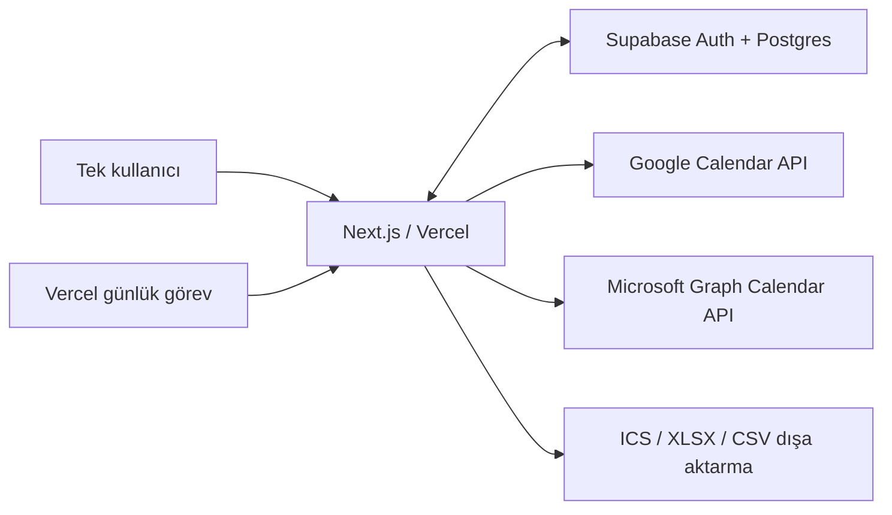

# Kişisel Takvim Uygulaması - Tasarım Belgesi

## Amaç

Tek bir kişinin Google Calendar ve Outlook Calendar etkinliklerini tek, özel ve hızlı bir arayüzde görmesini sağlamak. Uygulama ilk sürümde yalnızca okur; kaynak takvimlere hiçbir değişiklik yazmaz. Varsayılan görünüm, sağlanan PDF referansındaki gibi yılın on iki ayını aynı anda gösteren yıllık planlayıcıdır.

## Onaylanmış kapsam

- Türkçe arayüz; haftanın ilk günü Pazartesi; ana gösterim saat dilimi `Europe/Istanbul`.
- Yalnızca izin verilen e-posta adresine magic link ile erişim.
- Google Calendar ve Outlook Calendar için ayrı OAuth bağlantıları.
- Kullanıcının hesap başına gösterilecek takvimleri seçebilmesi.
- Kaynak etkinlikleri birleştirilmiş, salt-okunur görünümde gösterme.
- Her gün arka planda bir kez yenileme ve ekrandaki `Yenile` düğmesiyle anlık yenileme.
- Filtrelenmiş/seçili tarih aralığı için `.ics`, `.xlsx` ve `.csv` dışa aktarma.
- Masaüstünde 3 sütun x 4 satır yıllık takvim; ay, hafta ve gün ikincil görünümler.
- Dar ekranlarda hücreler sadeleşir; 2 sütuna, telefonda tek sütuna iner.
- Seçilen günün etkinliklerinin saat, konum ve kaynak bilgilerini gösteren ayrıntı paneli.
- Etkinlik oluşturma, düzenleme ve silme ilk sürümde kapsam dışıdır.

## Kapsam dışı

- Kaynak takvimlere etkinlik yazma.
- PDF dışa aktarma.
- Birden fazla bağımsız kullanıcı/çok kiracılı ürün deneyimi.

## Mimari

### Uygulama katmanı

Next.js uygulaması Vercel'de çalışır ve özel domain buraya bağlanır. Sunucu tarafındaki route handler'lar OAuth dönüşlerini, elle yenileme çağrısını ve dışa aktarma üretimini yönetir. Arayüz, yıllık görünümü önceliklendirir ve az sayıda bağımsız modülden oluşur: takvim ızgarası, ayrıntı paneli, filtreler, bağlantı ayarları ve dışa aktarma menüsü.

### Veri katmanı

Supabase; magic-link yetkilendirmesini, kullanıcı kısıtını, OAuth bağlantı verilerini, normalize edilmiş etkinlik önbelleğini ve eşitleme geçmişini tutar. Satır düzeyi güvenlik kuralları tek izinli kullanıcının verisi dışındaki her erişimi reddeder.

OAuth yenileme belirteçleri uygulama katmanının erişebildiği şifreli saklama alanında tutulur; istemciye hiç gönderilmez. Uygulama, yalnızca kullanıcı tarafından izin verilen kapsamları ister.

### Eşitleme akışı

1. Kullanıcı Google veya Microsoft hesabını bağlar ve takvimlerini seçer.
2. Günlük görev veya `Yenile` düğmesi, seçili takvimlerdeki değişiklikleri çeker.
3. Sağlayıcıya özgü kayıtlar ortak etkinlik modeline dönüştürülür ve Supabase'e yazılır.
4. Arayüz etkinlik önbelleğini okur, kaynak bazlı renk ve filtre uygular.
5. Hata halinde son başarılı veri korunur; kullanıcıya son başarılı yenileme zamanı ve bağlantı/izin sorunu gösterilir.

## Arayüz davranışı

Ana ekran PDF referansına benzer biçimde 12 ayı 3x4 ızgarada gösterir. Her gün en fazla iki kısa etkinlik etiketi ve gerekirse `+N` sayacı gösterir. Böylece yoğun günlerde hücre boyutu ve yıllık taranabilirlik korunur. Bir gün seçilince sağdaki panel o güne ait tüm etkinlikleri açar. Etkinlik kartı başlık, İstanbul saatindeki başlangıç/bitiş, konum ve kaynak takvimi gösterir.

Üst çubukta yıl seçici, Bugün, kaynak takvim filtreleri, Bağlantılar, Yenile, son eşitleme bilgisi ve Dışa Aktar bulunur. `Yeni Etkinlik` bulunmaz. Ay, hafta ve gün görünümleri ikincil navigasyondur; yıllık görünüm varsayılandır.

Dar ekranlarda bilgi yoğunluğu renk noktaları ve sayaçlarla azaltılır. Takvim iki sütun ve sonra tek sütuna iner; bu davranış, yıllık içeriği kaybetmeden okunabilirliği önceler.

## Dışa aktarma

Dışa aktarma, aktif tarih aralığını ve kaynak takvim filtrelerini uygular. ICS dosyası başka bir takvim uygulamasına içe aktarılabilir; CSV ve XLSX dosyaları analiz ve arşiv kullanımına uygundur. Tekrarlayan ve tüm gün etkinlikleri biçimlerin yetenekleri çerçevesinde kaynak anlamlarını korur.

## Gelecekte çift yönlü eşitleme

İlk sürüm hiçbir kaynağa yazmaz. Buna karşın ortak etkinlik modeli; sağlayıcı, uzak etkinlik kimliği, uzak değişiklik sürümü, son eşitleme zamanı ve eşitleme durumu alanlarını içerir. Bu alanlar, daha sonra arayüzden oluşturma/düzenleme/silme işlemlerinin ilgili Google veya Outlook etkinliğine yazılmasını sağlar.

Çift yönlü sürümde varsayılan çakışma politikası en son değişiklik kazanır. Yakın zamanlı veya belirsiz çakışmalarda uygulama sessizce veri ezmek yerine kullanıcıya karşılaştırma ve seçim sunar.

## Hata yönetimi ve güvenlik

- Bir sağlayıcının yenilemesi başarısız olduğunda diğer sağlayıcının verisi ve son başarılı içerik görünür kalır.
- Süresi dolan izinlerde yalnızca ilgili hesabın yeniden bağlanması istenir.
- Elle yenileme aynı anda tekrar başlatılamaz; işlem durumu kullanıcıya iletilir.
- OAuth belirteçleri ve tüm takvim verisi istemci tarafına gereksiz biçimde açılmaz.
- Magic-link erişimi izin verilen tek e-posta ile sınırlandırılır.

## Doğrulama stratejisi

- Google ve Microsoft dönüşümleri için birim testleri: tüm gün, saatli, tekrarlayan, iptal edilmiş ve saat dilimli etkinlikler.
- Yetkilendirme ve satır düzeyi erişim kuralları için entegrasyon testleri.
- ICS, CSV ve XLSX alan/doğruluk testleri.
- Günlük görev, elle yenileme, hatada son veriyi koruma ve izin yenileme testleri.
- Masaüstü yıllık görünüm, ay/hafta/gün görünümü ve dar ekran yerleşimi için uçtan uca kontroller.

## Teslim yaklaşımı

Uygulama Vercel'e dağıtılır, özel domain bağlanır ve gerekli Google/Microsoft OAuth yönlendirme adresleri bu domainle kaydedilir. Supabase projesi uygulama veritabanı ve kimlik doğrulaması için yapılandırılır. Canlıya alma, gerçek hesap bağlantısı ve örnek dışa aktarma dosyalarıyla doğrulanır.
